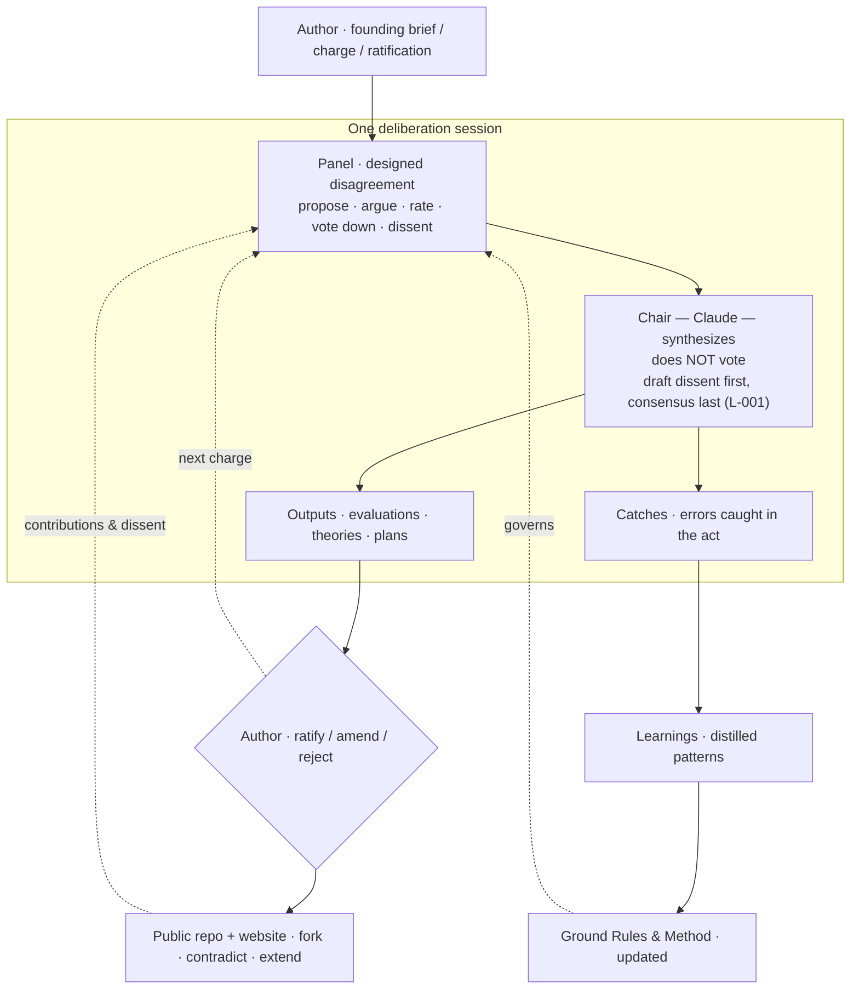
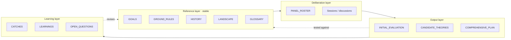
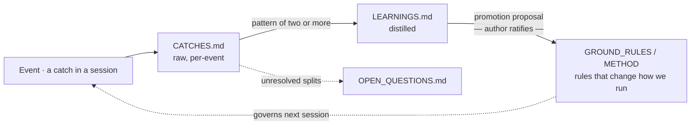
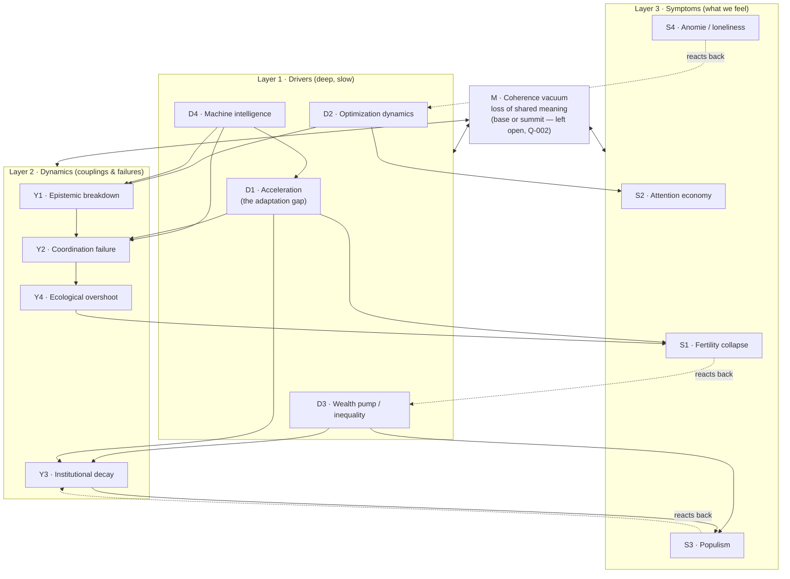
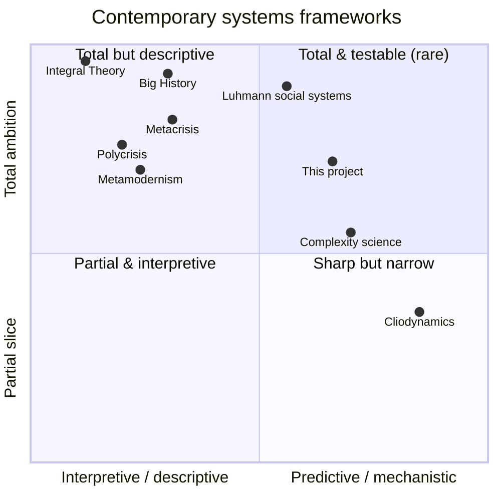
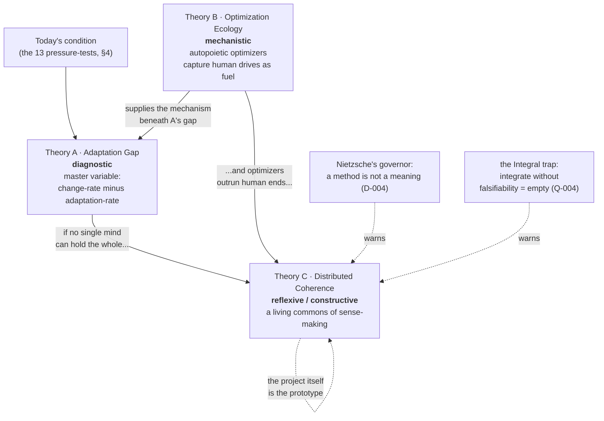
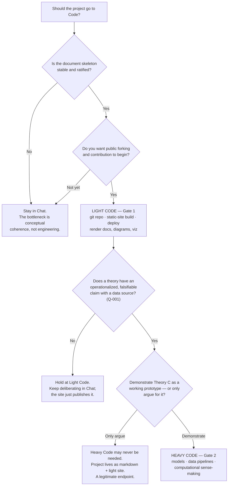
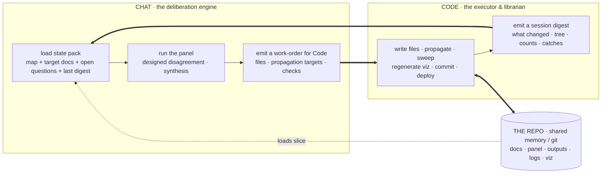
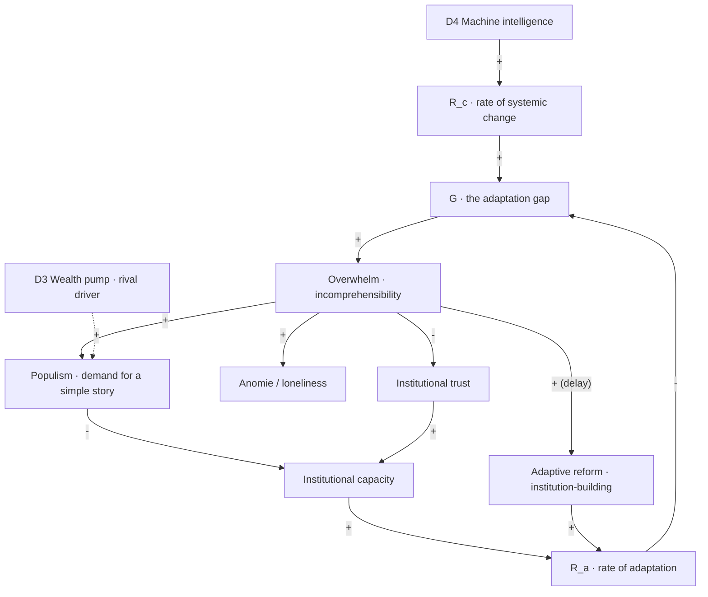

# DIAGRAMS

Version: 0.1 · Status: Living · Last updated: Session 2

*The project's logic and flows, drawn. Each diagram restates part of the argument in a second notation (the `VISUALIZATION.md` principle: if a coupling can't be drawn, we probably don't understand it yet). These are authored in **Mermaid**, which means two things at once: they **render natively on GitHub** (this file is both the log and the picture), and they live in the repo as **editable text** a contributor can fork and correct. The polished, interactive versions for the website are companions (`viz/`), generated from the same logic.*

> **Every diagram is a claim, and claims can be wrong.** Where a diagram encodes something the panel disputes, the caption says so and points to the open question. A diagram that implies more certainty than we have is a catch (Ground Rule 19).

---

## 1. The logic of the project (governance & session flow)

*How a session runs and how authority is divided: the panel argues, the chair synthesizes but never votes, the author ratifies, and the public extends. This is Theory C in miniature — a procedural totality.*

**What it asserts:** legitimacy flows in a loop, not a line — no node is sovereign. **The single point of risk** is the chair (all synthesis flows through it), which is why the L-001 guard and this whole `logs/` apparatus exist. **Contested?** No — this is the constitution (`METHOD.md`). But D-004 asks whether running this loop well actually *means* anything, or only *works*.

---

## 2. The document architecture as a flow

*Four layers, and how they feed each other. Reference is stable; deliberation is where the arguing happens; output is the product; learning revises the reference. The arrows are the important part.*

**What it asserts:** the project is not a stack of documents but a circuit — outputs are tested back against goals and history, and what's learned rewrites the rules. **Contested?** No, but Q-007 asks whether "tested against" is doing real work or is self-confirming.

---

## 3. The learning loop (does the project actually learn?)

*The reflexive test (Goal S5): a catch becomes a learning becomes a rule change. A learning that never reaches the third box is just an observation.*

**Worked instance:** in Session 1, catches C-003, C-005, C-006 were the same error three times → distilled into **L-001** → queued as a Ground-Rule amendment. In Session 2, that guard **caught C-007** (the layering smuggling a causal claim) *before* publication. That is the loop closing once — the first evidence the project learns rather than merely accumulates. **Contested?** The mechanism isn't; whether it will keep working under many contributors is `open`.

---

## 4. The pressure-tests as a layered concept map (the Seven-Problems map, expanded)

*The Session-2 restructuring: thirteen tests in four coupled layers, with directed arrows for how drivers produce dynamics produce symptoms — and dashed arrows for the feedback that runs back up. This is the visual we said would out-do "polycrisis": the couplings are **named and directed**, not a blob. It is also a **contested hypothesis**, not a filing system (C-007).*

*The **signed** version of this graph — every load-bearing edge given a direction, a sign, and (where known) a delay, with the R1/R2/B1 loops and the open base-or-summit question drawn — is `docs/PRESSURE_TESTS_CAUSAL_HYPOTHESIS.md` (ratified working hypothesis, Session 4e). That is what turns "everything is connected" into checkable directed claims.*

**What it asserts:** a *specific, testable* causal topology — e.g. optimization dynamics (D2) drive both the attention economy (S2) and epistemic breakdown (Y1); the wealth pump (D3) drives institutional decay (Y3) and populism (S3); anomie (S4) feeds back to intensify the optimization economy that produced it. **Heavily contested:** Marx rejects the driver/symptom cut; Nietzsche inverts M to the top; Le Guin notes the layout itself encodes a worldview (D-005, Q-002). The **arrows are the research program** — each is a hypothesis a contributor can strengthen, redirect, or break. A causal-loop diagram (signed +/−, with delays) for Theory A is the next refinement (`VISUALIZATION.md` D).

---

## 5. The landscape, positioned (where the field sits — and where we aim)

*The contemporary frameworks from `LANDSCAPE_OF_CONTEMPORARY_SYSTEMS_THEORIES.md`, placed on the two axes the project turns on. The rare corner — total ambition **and** testable — is nearly empty, and that emptiness is the niche. The marker for "this project (aim)" shows the target: joining and falsifiable, held provisionally.*

**What it asserts:** our reading (coarse, arguable) of each framework's register and ambition — and that the top-right quadrant is thinly populated. **Contested?** The exact coordinates are a judgment call, offered to be argued with; the *shape* (rigor and totality rarely co-occur, and meaning-holding frameworks cluster bottom-left and un-falsifiable) is the claim. Note the axes can't show the **meaning** dimension — for that, see the scored table in `LANDSCAPE_OF_CONTEMPORARY_SYSTEMS_THEORIES.md` §9.

---

## 6. The three candidate theories and how they relate

*Not three guesses at one answer, but three *kinds* of theory — diagnostic, mechanistic, reflexive — that fit together. B is the mechanism beneath A's gap; C is the response to the situation both describe; and two named dangers stalk C.*

**What it asserts:** the three theories are complementary registers, not competitors — which is why the deliverable ships all three. **Contested?** D-002 (is there one master condition at all?) and D-004 (is C a path or a dodge?) both live here. The self-loop on C is the reflexive wager, and Q-007 asks what would show it to have failed.

---

## 7. The path to Code — a decision tree (answering the author's question)

*When, if ever, does this leave Chat for Code? Two kinds of Code — **light** (repo + static site + deploy) and **heavy** (executable models, data, computational sense-making) — with different gates. The honest branch includes "may never need heavy Code."*

**What it asserts:** the decision is gated on *what is bottlenecking*, not on enthusiasm — Chat is correct while the work is thinking; Code becomes correct only when there is a stable thing to build or a real quantity to compute. **Where we are now (revised in Session 2):** the skeleton is stable *enough* (further change is content, not structure), and a second trigger overrides the original gate — **context capacity**: the project hit a compaction and message run-outs, so Chat can no longer reliably hold the whole state. That moves **Light Code + the Chat/Code shuttle to now** (§8); **Heavy Code stays gated on Q-001**. Full plan in `docs/CHAT_CODE_WORKFLOW.md`; the open question is Q-009.

---

## 8. The Chat/Code shuttle (how the project is operated across two tools)

Answering the second half of the author's question — not just *when* to use Code but *how* Chat and Code work together once the deliberation outgrows a single context window.

**What it asserts:** **Chat is the mind, the repo is the memory, Code is the hands.** Neither side holds the whole project in one context — Chat loads only a *slice*, Code reads the full repo from disk — the direct fix for the context-window limit that forced Session 2's compaction. Propagation and consistency-sweeps become Code's deterministic job (the C-010 / L-006 fix), so a structural change can no longer leave stale records. Authority is unchanged: the panel proposes, the chair never votes, the author ratifies, Code executes only ratified work-orders. This is the author's existing two-Claude writing workflow applied here. Full plan: `docs/CHAT_CODE_WORKFLOW.md`; open watch-items Q-010 (slice granularity) and Q-011 (divergence reconciliation).

---

## 9. Theory A as a signed causal loop (the gap, drawn)

The first bridge from prose to a runnable model (`outputs/THEORY_A_OPERATIONALIZED.md`): Theory A's variables and their signed couplings, with the two loops that decide whether the gap is a trap or self-correcting.

**What it asserts.** Two exogenous drivers push the rate of change up (D4 machine intelligence directly; the wealth pump D3 enters as a *rival* driver of populism, dashed — the discriminator of §6 in the operationalization). The gap G is the difference of the two rates; it drives Overwhelm, which drives the symptoms. Two loops decide the system's fate:

- **R1 — the reinforcing trap (vicious cycle):** Overwhelm → Populism (+) → Institutional capacity (−) → adaptation rate (slower) → Gap (wider) → Overwhelm (+). Populism degrades governance, which slows adaptation, which widens the gap — Theory A's core worry.
- **B1 — the balancing hope (self-correction, delayed):** Overwhelm → Adaptive reform (+, with delay) → adaptation rate (+) → Gap (−) → Overwhelm (−). Overwhelm eventually provokes institution-building that closes the gap. This is the **accelerationist / techno-optimist counter** (D-006) made visible as a real loop: if B1 is fast and strong, the gap is a transitional feature; if R1 dominates and B1 is too slow, it is a trap. **Which loop wins is an empirical question, not a foregone one** — exactly what the operationalization is built to test.

*Signs are +/−; the dashed edge is the rival driver; "(delay)" marks the slow balancing path. A first, criticizable draft — the signs and especially the delays are hypotheses to test, not settled facts (Ground Rule 19; Q-001).*

---

## Diagram backlog

1. ✅ Governance/session flow · document-architecture flow · learning loop (§1–3).
2. ✅ Layered pressure-test concept map (§4) — the expanded Seven-Problems map.
3. ✅ Landscape positioning quadrant (§5).
4. ✅ Candidate-theory relationships (§6) · path-to-Code decision tree (§7) · the Chat/Code shuttle (§8).
5. ✅ **Signed causal-loop diagram for Theory A** (§9) — variables, +/− arrows, the reinforcing trap R1 and the balancing hope B1, delays marked — the bridge to any executable model.
6. **Next:** leverage-point overlay (Meadows) on the Theory-A loop; signed causal-loops for B and C.
7. **Phase 1+:** time-series dashboard once data is enlisted; model-provenance graph once forks exist.

*Each diagram is registered in `METRICS.md`; if one ever misleads, it is corrected with a note in `logs/CATCHES.md`. Interactive web renders live in `viz/` (`systems-theory-map.html`; `diagrams.html`).*

*Author: Hulki Okan Tabak — with Claude · License: CC BY-SA 4.0 (docs) / MIT (any code)*
