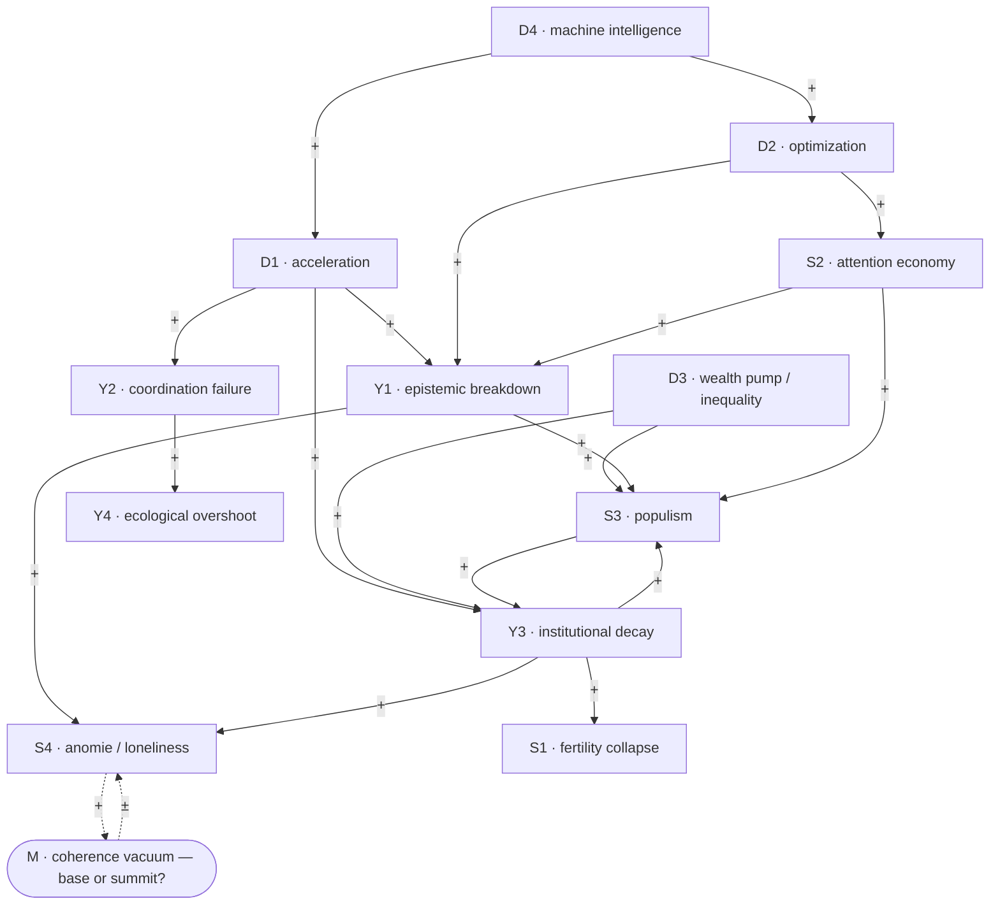

# THE PRESSURE-TEST CAUSAL HYPOTHESIS — drawing the arrows

Version: 1.0 · Status: **RATIFIED (author, Session 4e) as the working — still contested — causal hypothesis; NOT a settled taxonomy; signs and delays are claims to test, not facts.** · Last updated: Session 4e
Source: `docs/GOALS.md`, `panel/SESSION_2_PRESSURE_TESTS.md`, `docs/DIAGRAMS.md` §4 (the thirteen tests). Companion to `outputs/THEORY_A_OPERATIONALIZED.md` §9 (Theory-A loop) and the operationalizations of A/B/C.

> The project has always said the **arrows between the layers are the research program** — that "everything is connected" only becomes criticizable once you commit to *which* thing drives *which*, with *what sign* and *what delay*. This document does that: it proposes a specific **signed causal hypothesis** over the thirteen pressure-tests. It is deliberately falsifiable and deliberately contestable. Drawing it is what separates this project from the polycrisis literature, which names the entanglement but never commits the graph.

---

## 1. The signed graph (load-bearing edges only)

*Not every conceivable edge — the strongest proposed couplings. "+" = same-direction; the dashed node **M** and its edges mark the open base-or-summit question (Q-002).*

## 2. The load-bearing pathways (why each arrow)

**Machine intelligence as a driver of drivers.** D4 → D1 and D4 → D2: AI is not a peer symptom but an **amplifier** — it accelerates the rate of change and hands the optimizers sharper tools. This is why "AI" appears as a driver-of-drivers, not a symptom: its causal role is to multiply two other drivers.

**Acceleration surfaces in the dynamics.** D1 → {Y1, Y2, Y3}: when the built world changes faster than institutions, cognition, and shared culture can absorb it, the capacity to *check* falls behind the capacity to *fabricate* (Y1), coupled systems fragment faster than they can be governed (Y2), and institutions built for a slower world lose fit and legitimacy (Y3). This trio *is* Theory A's gap, distributed across subsystems.

**Optimization is its own driver, with a home symptom.** D2 → S2 (the attention economy is optimization's direct product) and D2 → Y1 (engagement-optimization is a **selection environment** that structurally rewards unreality — the reason "post-truth" undershoots). This is Theory B's territory.

**The wealth pump drives decay and revolt.** D3 → Y3 and D3 → S3: Turchin's mechanism — elite overproduction plus popular immiseration erode state legitimacy (Y3) and fuel populist revolt (S3) — enters as a **rival driver**, not a special case of acceleration. Whether D3 or D1 better explains S3 is exactly the A-vs-Turchin discriminator in Theory A's study.

**Dynamics surface as symptoms.** Y1 → {S3, S4} (fragmented truth breeds simple stories and disorientation); Y3 → {S1, S3, S4} (institutional thinning removes the frames that made children the default, that make institutions feel responsive, and that locate people); Y2 → Y4 (a world that cannot coordinate on long-horizon collective action overshoots its ecological limits).

## 3. The loops (where the system's fate is decided)

- **R1 — the reinforcing trap (Y3 ⇄ S3).** Institutional decay breeds populism (Y3 → S3), and populism degrades institutional capacity (S3 → Y3): a vicious cycle. Extended through D1 → Y3, this is Theory A's reinforcing loop — the gap widening because the response to it makes adaptation *slower*.
- **R2 — the capture loop (D2 → S2 → Y1 ⟶ D2).** Optimization produces the attention economy, which degrades shared epistemics, which **weakens the collective capacity to regulate optimization** — so D2 persists and deepens. Theory B's autopoietic self-reinforcement, drawn.
- **B1 — the balancing hope (delayed).** Acute crisis or overshoot (Y4, or a sharp symptom) can provoke **adaptive reform** that restores institutional capacity (reduces Y3), damping the symptoms — Theory A's delayed balancing loop, and the accelerationist's counter (D-006): *if B1 is fast and strong, the gap is transitional; if R1/R2 dominate and B1 is too slow, it is a trap.* Which loop wins is empirical, not assumed.

## 4. The master condition M — drawn as a question, not an answer

**M (the coherence vacuum)** is deliberately drawn with dashed, bidirectional edges because its position is **open (Q-002)**:
- **M-as-base:** the loss of a shared "why" comes first and makes everything downstream easier — the meaning-vacuum lowers resistance to capture (Nietzsche's Last Man is pre-adapted to the dopamine economy), so **M → S2, S4** with a weakening effect on resistance.
- **M-as-summit:** the drivers, dynamics, and symptoms **hollow out** shared meaning as their aggregate residue, so **{everything} → M**.

The graph refuses to commit, because the panel has not resolved it and pretending otherwise would violate the project's own honesty. The dashed edges *are* the open question.

## 5. How the three theories live on this graph

- **Theory A** is the claim that the whole graph is powered by **D1** (with D4 amplifying it), read through the D1 → {Y1,Y2,Y3} → symptoms pathways and the R1/B1 loops. Its test: does a measured gap predict the symptom set, controlling for D3?
- **Theory B** is the claim that **D2** (with D4 amplifying it) and the R2 capture loop are the operative mechanism, read through D2 → S2 → Y1. Its test: does optimization intensity predict capture, and does de-optimization reverse it?
- **Theory C** is not a node — it is the claim that **a graph like this can only be built and corrected by a plural, self-correcting commons**, and that the arrows must stay revisable. C is the *method that drew the graph*, held to its own ablation test.

The theories are therefore **not exclusive**: A and B name different power sources for overlapping pathways; where they make *different* predictions (wide-gap/low-optimization vs narrow-gap/high-optimization domains) is exactly where their studies distinguish them.

## 6. What this buys, and what to test next

Drawing the graph converts "the polycrisis" from a mood into a set of **checkable directed claims**. The near-term research program is, literally, to test the arrows: the A study tests the D1-pathways and the D3 discriminator; the B study tests the D2 → S2 → Y1 pathway and the R2 loop via de-optimization events; the strongest single crux is **D3-vs-D1 into S3/Y3** (is populism driven more by the wealth pump or by the adaptation gap?), which both studies bear on. A signed causal loop for B and for C (paralleling A's §9) is the next diagramming step.

## 7. Preserved contestation (the structure itself is disputed — do not treat as settled)

- **Marx:** the driver/symptom cut is **ideology**. What the graph calls "symptoms" (populism, anomie, fertility) are the system **working as designed for whoever benefits** (D3 is not one driver among four — it is the point). The graph should perhaps be redrawn with the wealth pump as the root, not a peer.
- **Nietzsche:** **M belongs at the summit**, not floating dashed at the side — the coherence vacuum is the central fact, and a graph that makes it one node among fourteen has already missed it.
- **Le Guin:** any ordering **encodes a worldview**. Choosing D1/D2 as roots (a technological framing) rather than, say, a relational or ecological root is itself a value-posit; the graph is not neutral and should not pretend to be.
- **Luhmann:** the arrows imply steering and causation between subsystems that, on his account, **cannot directly steer one another** — the couplings may be structural resonances, not causal pushes, and "→" may be the wrong primitive.
- **Heidegger (standing):** drawing the whole as an optimizable causal diagram is *itself* the enframing the project is trying to understand — the map may be a symptom.

These objections are **not resolved**. They are the reason the graph is versioned, contestable, and forkable — and the reason the signs and delays are hypotheses, not facts.

---

*Ratified working hypothesis (author, S4e); contestation preserved. Author: Hulki Okan Tabak — with Claude · License: CC BY-SA 4.0.*
